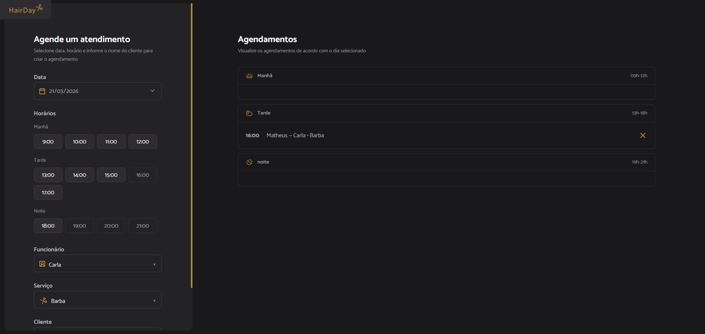

# HairDay ✂️📅  
Sistema web para agendamento de atendimentos em barbearia/salão, com controle de horários, funcionário e serviço — usando **JavaScript + Webpack** no front e **Supabase** como backend (PostgreSQL + API).



> ✅ Projeto finalizado e pronto para portfólio (deploy no Netlify/Vercel).

---

## ✨ Demonstração
- **Frontend:** (cole aqui a URL do Netlify quando publicar)
- **Banco/API:** Supabase (Postgres)

---

## ✅ Funcionalidades
- Criar agendamento informando:
  - Data
  - Horário
  - Funcionário
  - Serviço
  - Nome do cliente
- Listagem de agendamentos por período:
  - Manhã (09h–12h)
  - Tarde (13h–18h)
  - Noite (19h–21h)
- Cancelamento de agendamento com **modal de confirmação**
- Atualização automática da lista e horários ao:
  - Alterar a data
  - Alterar o funcionário
- Interface em tema escuro e layout responsivo

---

## 🚀 Principais melhorias (vs versão original)
Este projeto começou a partir de uma versão simples (agendamento básico), e foi evoluído com várias melhorias:

### 1) Persistência real com Supabase (substitui `db.json/json-server`)
- Antes: dados em `db.json` local (instável para deploy)
- Agora: **Supabase Postgres**, permitindo deploy real e persistência online

### 2) Seleção de Funcionário e Serviço
- Adicionado campos para selecionar **quem atende** e **qual serviço será feito**
- Os dados são salvos e exibidos na lista de agendamentos

### 3) Bloqueio de horários por funcionário
- O mesmo horário pode existir para funcionários diferentes
- Mas o sistema bloqueia o horário **somente para o funcionário selecionado**

### 4) UI/UX mais profissional
- Modal de confirmação para:
  - Confirmar agendamento
  - Cancelar agendamento
- Selects/inputs padronizados com o layout (tema dark)
- Labels e informações formatadas corretamente (ex.: “Ana”, “Corte + Barba”)

### 5) Estabilidade e organização
- Separação em módulos (`modules/`, `services/`, `libs/`)
- `services` isolam integração com API
- `modules` controlam regras da página e DOM

---

## 🧱 Tecnologias utilizadas
- **JavaScript (ES Modules)**
- **Webpack** (build e dev server)
- **Day.js** (datas e horários)
- **Supabase** (PostgreSQL + API)
- HTML + CSS (layout dark)

---

## 📂 Estrutura do projeto
```txt
src/
  assets/              # ícones e imagens
  libs/                # utilitários (dayjs, modal, dropdown)
  modules/
    form/              # regras de formulário (submit, horários)
    schedules/         # carregar/exibir/cancelar agendamentos
    page-load.js       # inicialização da página
  services/            # comunicação com Supabase
  styles/              # estilos globais e do formulário
  index.html
webpack.config.js